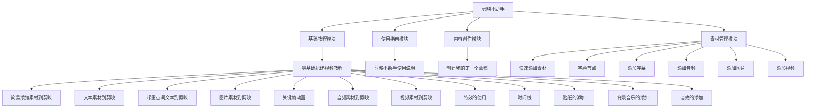

# 剪映小助手节点框架

根据界面显示内容，剪映小助手的节点可以分为以下几个主要模块：

## 1. 基础教程模块
- 零基础搭建视频教程
  - 简易添加素材到剪映
  - 文本素材到剪映
  - 带重点词文本到剪映
  - 图片素材到剪映
  - 关键帧动画
  - 音频素材到剪映
  - 视频素材到剪映
  - 特效的使用
  - 时间线
  - 贴纸的添加
  - 背景音乐的添加
  - 音效的添加

## 2. 使用指南模块
- 剪映小助手使用说明

## 3. 内容创作模块
- 创建我的第一个草稿

## 4. 素材管理模块
- 快速添加素材
- 字幕节点
- 添加字幕
- 添加音频
- 添加图片
- 添加视频

## 节点关系流程图

标签: #工具/媒体/视频 #类型/工具 #AI/工具/在线服务 